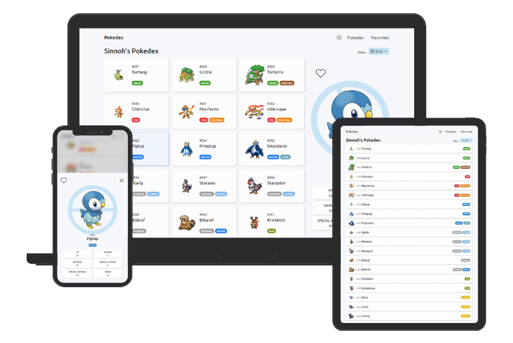

<div align="center">
  <h1>Sinnoh's Pokedex</h1>
  Designed and coded with ♥ by Pedro Ramos
</div>

<br>

## Details

This project is made with:
- [Vite + React](https://vitejs.dev/)
- [Sass (scss)](https://sass-lang.com/)
- [PokeAPI](https://pokeapi.co/)


## Preview



## Installation

To clone and run this application, you'll need [Git](https://git-scm.com) and [Node.js](https://nodejs.org/en/download/) (which comes with [npm](http://npmjs.com)) installed on your computer. From your command line:

```bash
# Clone this repository
$ git clone https://github.com/pedrorxmos/pokedex-sinnoh

# Go to the project directory
$ cd pokedex-sinnoh

# Install dependencies
$ npm install

# Run the app
$ npm run dev
```

## Deployment

To deploy this applicattion, you have to use:

```bash
$ npm run build
```

## Testing

To test this application you should use:

```bash
$ npm run test
```


## My Links
- My web: [pedrorxmos.com](https://pedrorxmos.com)
- Github: [@pedrorxmos](https://github.com/pedrorxmos)
- LinkedIn: [@pedroramosguardiola](https://linkedin.com/in/pedroramosguardiola)
- Codepen: [@pedrorxmos](https://codepen.io/pedrorxmos)
- Mail: [pedrorxmosdev@gmail.com](mailTo:pedrorxmosdev@gmail.com)